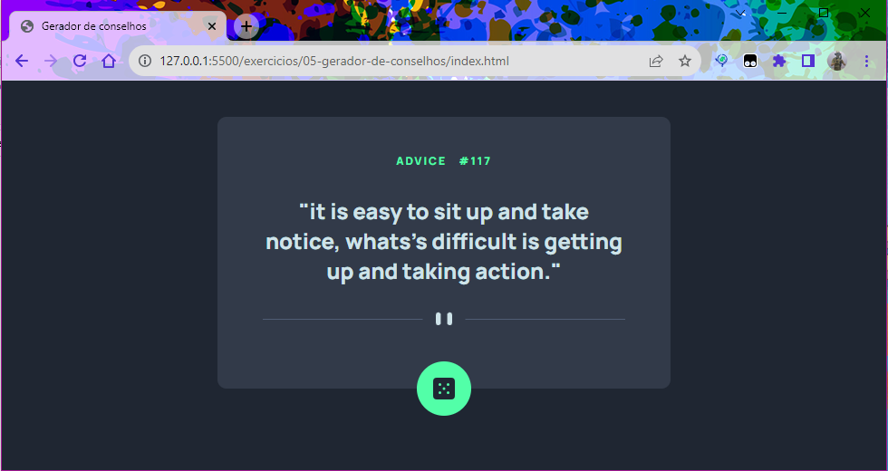

# Este é um projeto de gerador de conselhos.
## Utilizado para aplicar os conceitos do frontend, tendo um foco maior no conceito de responsividade e flexbox.

---

<h3>No exemplo abaixo temos o design em desktop.</h3>

---
<h3>Agora as versões mobiles responsivas.</h3>

<h4>Primeira temos a versão de 425px <h4>

---

<h4>Agora a versão de 320px <h4>

